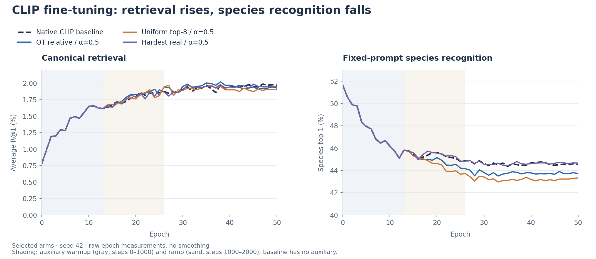

# OTCO: Optimal Transport Contrastive Learning

Research code studying **when synthetic hard negatives help multimodal contrastive learning—and when they hurt**. OTCO uses optimal transport (OT) to weight nearby mismatched embeddings, mixes them into synthetic negatives, and studies the resulting training pressure.

Current evidence separates **negative hardness, gradient direction, and downstream performance**. A harder synthetic negative is not automatically a more useful training signal. This is an exploratory research repository; the training comparisons below use one seed.

## Explore

- [CLIP experiments: purpose, controls, results, and interpretation](docs/clip-experiments.md)
- [Next Colab experiment: gradient usefulness across fine-tuning stages](docs/clip-gradient-stages.md)
- [Earlier ResNet-50 + DistilBERT experiments](docs/legacy-experiments.md)
- [Setup and running experiments](docs/running-experiments.md)
- [Archived CLIP reports, epoch metrics, and resolved configs](experiment_results/clip_2026-08-30_to_09-01/README.md)
- [Chronological research logs](experiment_logs/)

## Latest results: pretrained CLIP on CUB-200

Results from August 30–September 1, 2026. All eight runs fine-tune `openai/clip-vit-base-patch32` for 50 epochs with seed 42, batch size 64, and the native symmetric CLIP loss. A 1,024-image diagnostic holdout is excluded from training, leaving 4,970 training images; evaluation uses 5,794 images.

**Final canonical Avg R@1** is the average of text→image and image→text R@1 using one canonical caption per image. Species top-1 uses fixed species prompts and measures a different capability. These are epoch-50 results, not the best retrieval epoch.



Selected training trajectories; the table below includes all eight arms. [More plots and vector exports](docs/figures/README.md).

| Experiment | Purpose | Avg R@1 | Species top-1 |
|---|---|---:|---:|
| Native CLIP baseline | Establish the fine-tuning reference | 1.968% | 44.55% |
| OT + absolute sigmoid, α=0.05 | Test the historical auxiliary loss | 1.864% | 42.60% |
| OT + relative denominator, α=0.05 | Test an auxiliary loss relative to CLIP logits | 1.899% | 44.49% |
| OT + relative denominator, α=0.5 | Increase auxiliary strength | 1.924% | 43.72% |
| Uniform top-32, α=0.5 | Isolate OT weights from mixing on the same support | 1.924% | 43.89% |
| Uniform top-8, α=0.5 | Test narrower synthetic support | 1.907% | 43.32% |
| Uniform top-8, α=0.134 | Match early gradient pressure to hardest-real | 1.924% | 44.03% |
| Hardest real, α=0.5 | Compare synthesis with a real negative | 1.942% | 44.65% |

No auxiliary variant improves final canonical average R@1 over baseline in these runs. Some improve individual retrieval metrics or intermediate peaks; there is no consistent overall gain. Every run's best species checkpoint is epoch 0 (**51.61%** species top-1), showing a tradeoff between caption retrieval adaptation and species recognition.

Frozen diagnostics explain why hardness alone is insufficient: uniform top-8 negatives exceed the hardest real negative's similarity for **98.47%** of queries across three shuffled partitions, yet their joint embedding gradients have mean cosine **−0.294** with the hardest-real auxiliary gradients. Their predicted real-negative margin change is negative on average. These are local frozen-embedding measurements, not a causal explanation of full training.

The CLIP gap gate never suppresses or downweights an active auxiliary step in the recorded runs; its coefficient follows warmup and ramping. The pressure-matched experiment matches the hardest-real arm's early projection-gradient ratio, not its entire training trajectory. See the [full CLIP analysis](docs/clip-experiments.md) for definitions and limitations.

## Earlier experiments

These use **ResNet-50 + DistilBERT with a SigLIP-style loss**, a different protocol from the CLIP study.

| Dataset / comparison | Recorded result | Interpretation |
|---|---|---|
| Flickr30K: OT-Mix vs. continued baseline | Both reach 32.50% Avg R@1 | Extra training explains the apparent OT gain |
| CUB-200: baseline vs. adaptive gated OT-Mix | 1.38% vs. 1.44% official/best-checkpoint Avg R@1 | Small one-seed improvement |
| CUB-200: cached-pool gated OT-Mix, N=128 | 1.48% official/best-checkpoint Avg R@1 | Positive historical result with detached image support |
| CUB-200: fresh batch-local plan, update every step | 1.41% vs. 1.44% with update interval 10 | No improvement in this one-seed ablation |

The [historical experiment notes](docs/legacy-experiments.md) preserve epoch tables, gating observations, and checkpoint-selection details. These older numbers are not a controlled architecture comparison with CLIP.

## What is implemented

- **Negative construction:** OT barycenters, uniform barycenters, OT selection, hardest-real negatives, and memory-bank negatives.
- **Training:** historical SigLIP-style experiments; controlled CLIP fine-tuning with absolute or relative auxiliary losses; warmup, ramping, and optional gates.
- **Diagnostics:** cosine/logit scale controls, sparse transport audits, support-width and weighting ablations, adaptive neighborhoods, and tangent-gradient comparisons.

Code: [losses](model/loss.py), [CLIP objectives](model/clip_training.py), [training and diagnostics](src/), [configs](configs/), and [Colab runners](colabs/).

## Quick start

Requires Python 3.12+; the controlled CLIP training configs require CUDA with at least 14,000 MiB VRAM. The archived runs used an A100 40 GB.

```bash
uv sync
uv run python -m src.clip_train --config configs/hf_cub200_clip_vit_b32_baseline.yaml
```

See [setup and commands](docs/running-experiments.md) for frozen diagnostics, other CLIP arms, legacy training, dataset handling, and output locations.

## Research direction

The [staged-gradient Colab experiment](docs/clip-gradient-stages.md) is ready to test whether synthetic-negative gradients become useful during fine-tuning: fixed held-out batches at initialization, before auxiliary activation, after ramping, and at epoch 50. GPU results are pending. Additional training seeds are needed before claiming reliable gains or ranking close variants.

Paper in preparation. The [original OT proposal](https://github.com/akashm776/ot-paper) records the initial hypotheses; current conclusions are grounded in the experiments linked above.
