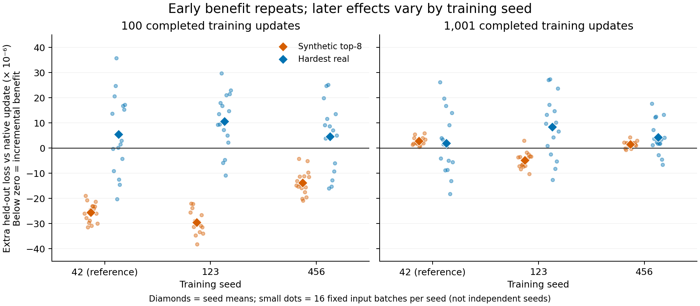

# OTCO: Optimal Transport Contrastive Learning

Research code studying **when synthetic hard negatives help contrastive learning—and when they do not**. OTCO uses optimal transport to weight nearby mismatched embeddings and mix them into synthetic negatives. Uniform mixtures and real-negative controls test which parts actually matter.

The current evidence separates **hardness, gradient direction, actual optimizer updates, and downstream performance**. CLIP/CUB-200 studies include a three-seed one-step replication; longer training interventions remain primarily single-seed. They do not establish a general curriculum rule.

## Research progress

| Study | Status | Main finding |
|---|---|---|
| [Original CLIP ablations](docs/clip-experiments.md) | Completed | No auxiliary variant beats baseline final average R@1 in the eight 50-epoch runs |
| [Gradients across fine-tuning](docs/clip-gradient-stages.md) | Completed | The per-query synthetic margin proxy improves during native-only warmup |
| [Dense warmup / shared-head probes](docs/clip-warmup-readiness.md) | Completed | Weak positive head alignment at update 100 becomes near-zero or negative later |
| [Early-pulse intervention](docs/clip-early-pulse.md) | Completed | Tiny retrieval gain, lower species accuracy; no convincing overall benefit |
| [Paired actual-AdamW updates](docs/clip-paired-updates.md) | Completed, seed 42 | Synthetic update improves held-out loss in 16/16 early trials, 0/16 later trials; effects are small |
| [Two-seed replication](docs/clip-paired-seed-replication.md) | Completed | Early benefit repeats in seeds 123 and 456; later effects are smaller and change sign across seeds |
| [Intermediate checkpoints](docs/clip-paired-intermediate.md) | Prepared, not run | Measure updates 100, 250, 500, 750 and 1,001 across the same three seeds; investigate fading usefulness without choosing a universal cutoff |

## Latest completed experiment: three-seed paired-update comparison

Restore each baseline model **and AdamW state**, take one native-only or auxiliary-augmented update, then compare loss on 1,024 held-out examples. The two new training seeds add **192 audited branches** to the previous seed-42 experiment. The same 16 diagnostic training batches are used at updates 100 and 1,001 across all seeds.

| Training seed | Early synthetic effect; beneficial trials | Later synthetic effect; beneficial trials |
|---|---:|---:|
| 42 — previous run | −25.63; **16/16** | +2.72; **0/16** |
| 123 | −29.56; **16/16** | −4.87; **15/16** |
| 456 | −13.80; **16/16** | +1.43; **3/16** |

Effects are mean extra held-out loss in units of **10⁻⁶**; negative means better than the paired native-only step, not an accuracy gain. **The small early benefit repeats; consistently harmful later pressure does not.** Later effects are weaker and seed-dependent. Seed 123's later synthetic step helps by reducing the loss increase caused by its native-only step, not by improving on the initial checkpoint.



These are three training seeds, not 48 independent replicates per stage. One-step effects on a reused holdout do not prove a long-term curriculum gain, an exact activation window, or transfer beyond CLIP/CUB. The hardest-real control has worse mean loss than native-only at both states in all three seeds on the primary score.

[Protocol, findings and limitations](docs/clip-paired-seed-replication.md) · [192 new records and audit](experiment_results/clip_paired_seeds_2026-09/README.md) · [Seed-42 reference](experiment_results/clip_paired_updates_2026-09/README.md)

## Earlier evidence

The [13-epoch early-pulse intervention](docs/clip-early-pulse.md) adds synthetic pressure for 100 updates, then switches it off. Final canonical average R@1 is **1.631% vs 1.614%** for baseline (+0.017 percentage points, a net two retrieval successes), while species accuracy falls **0.259 points**. Thus an early one-step benefit has not translated into a convincing overall training gain. [Training differences](docs/figures/clip_early_pulse_differences.png).

The [original CLIP study](docs/clip-experiments.md) compares eight 50-epoch arms: baseline finishes at **1.968%** canonical average R@1, versus **1.907%** for uniform top-8 and **1.942%** for hardest-real at maximum α=0.5. Every arm's best species checkpoint is epoch zero. These longer-run values must not be directly ranked against the 13-epoch pulse values.

[Earlier ResNet-50 + DistilBERT experiments](docs/legacy-experiments.md) use a different architecture and SigLIP-style objective. They are historical evidence, not a controlled architecture comparison with CLIP.

## Run and reproduce

Requires Python 3.12+; GPU experiments use A100 Colab runtimes. See [setup and commands](docs/running-experiments.md), [Colab runners](colabs/), and each study's protocol. The next [intermediate-checkpoint cell](colabs/clip_paired_intermediate_one_cell.py) is local-only with one combined ZIP download and **no Drive writes**. Earlier runners may use Drive backups. Check the experiment's completion marker, not just the launcher's status.

```bash
uv sync
uv run python -m src.clip_train --config configs/hf_cub200_clip_vit_b32_baseline.yaml
```

Code: [CLIP objectives](model/clip_training.py), [training and diagnostics](src/), [configs](configs/), [tests](tests/). Evidence: [original CLIP archive](experiment_results/clip_2026-08-30_to_09-01/README.md), [curriculum studies](experiment_results/clip_curriculum_2026-09/README.md), [figures](docs/figures/README.md), [chronological logs](experiment_logs/).

Paper in preparation. The [original OT proposal](https://github.com/akashm776/ot-paper) records the initial hypotheses; conclusions now follow the experiments above.
