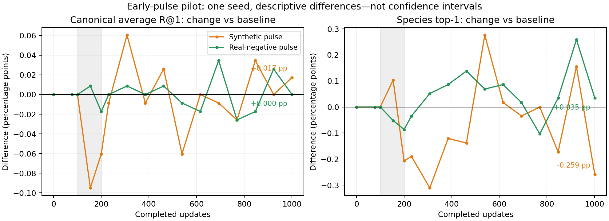

# Early synthetic-negative pulse: causal pilot

[Project](../README.md) · [Readiness diagnostic](clip-warmup-readiness.md)

## Completed result — September 12, 2026

**A near-null single-seed pilot, not a convincing overall benefit.** All three arms completed 1,001 updates with exactly matching pre-pulse model/optimizer/RNG hashes. Both treatment audits contain exactly objective steps 100–199. The baseline endpoint features reproduce the previous baseline experiment exactly.

| Arm | Final canonical Avg R@1 | Difference vs baseline | Species top-1 |
|---|---:|---:|---:|
| Baseline | 1.613738% | — | 45.823264% |
| Uniform-top-8 pulse | 1.630998% | +0.017259 pp | 45.564377% |
| Hardest-real pulse | 1.613738% | 0.000000 pp | 45.857784% |

The synthetic primary-endpoint gain corresponds to a net two additional top-1 retrieval successes across the two directions (one fewer text→image, three more image→text). It costs 15 species-classification successes, or −0.258887 percentage points. All-caption text→image R@1 is unchanged, and image→text R@1 is slightly lower. Immediately after the pulse (step 200), synthetic canonical Avg R@1 is **0.060407 points below** baseline. The later differences fluctuate around zero rather than forming a sustained advantage. No uncertainty over training seeds can be estimated from this one run.



Synthetic projection-head alignment with native symmetric CLIP falls from **+0.078418** at 100 to **−0.019591** at 200, then **−0.017059** at 1,001. Baseline's corresponding values are +0.078418, +0.006418 and −0.017358. The older per-query embedding margin remains positive; that proxy and the shared-head diagnostic are not interchangeable. Better gradient agreement in the real-negative control also does not produce a final canonical R@1 gain.

Calibration sets coefficients to **0.06005351588542947** (synthetic) and **0.3753711620568176** (real). Actual mean full-parameter auxiliary/native gradient ratios during the pulse are **7.772%** and **10.181%**, respectively; matching on calibration batches did not continuously equalize pressure.

[Archived audit, metrics and provenance](../experiment_results/clip_curriculum_2026-09/README.md) · [Full training curves](figures/clip_early_pulse_performance.png). The ZIP audit checked all 120 files, nine stage feature/metadata hashes, 36,864 valid query-partition observations, and 288 head/batch probe records. One fixed batch per stage was recomputed on CPU within floating-point tolerances. The archived audit summarizes the measured comparisons; it does not make the repeated inputs independent replications.

**Completed follow-up:** [paired actual-AdamW updates](clip-paired-updates.md) find a small synthetic held-out benefit at update 100 and a smaller disadvantage at 1,001. This one-step result does not overturn the near-null longer-horizon pilot. The preregistered design below is retained unchanged for provenance.

## Question and preregistered decision

Does briefly adding synthetic-negative pressure early in fine-tuning improve what native CLIP would learn anyway? The preceding single-seed diagnostic found weak positive projection-head alignment at update 100 (6/6 selected shuffled batches), near-zero mean alignment at 250, and negative means at 500–1,001. This motivates a candidate interval; it does not establish an optimal window or a general OTCO principle.

Compare **baseline**, **uniform-top-8 synthetic**, and **hardest-real** arms. Apply the auxiliary only for objective-step indices **100–199**: the first pulse update takes the model from 100 to 101 completed updates; the last takes it from 199 to 200. No ramp or adaptive gate. Then return to native-only training through **1,001 updates / 13 epochs**, keeping the original **3,850-update cosine schedule**, optimizer, seed 42, data exclusion, captions, and batch order.

This is a uniform-synthetic intervention, not a test of OT weighting. Native CLIP trains the logit scale; the auxiliary uses its detached value. Positive-excluded raw-cosine top-8 support is stop-gradient, uniform barycentric image paths remain live, and the auxiliary is the existing text-to-image relative-denominator increment. Hardest-real duplicates the hardest real negative in that denominator.

## Strength matching and exact controls

At the common update-100 state, use four disjoint B64 **training** batches, selected with NumPy generator seed 20260911 from the training complement. Use epoch-2 training captions, train mode, and the same bf16 path as the intervention. Never calibrate on the excluded diagnostic holdout or test set.

For each auxiliary, freeze `alpha = 0.10 * mean(native gradient norm) / mean(auxiliary gradient norm)`. Norms include **all trainable parameters**, before clipping (including native logit-scale derivatives; auxiliary scale derivative is zero). The 10% target is a conservative, predeclared pilot choice, not tuned using outcomes. This matches the ratio of mean norms on calibration batches, not every future batch, gradient direction, or AdamW update magnitude. Log realized full-parameter ratios for all 100 pulse updates; the ordinary total-gradient clip remains active.

Rerun the identical seeded baseline prefix per arm. At update 100, require exact canonical hashes of model, optimizer, scheduler, Python/NumPy/Torch/CUDA RNGs, loader generator, epoch, and consumed-batch position. Fail before treatment if any differ. Save the common full model/optimizer/RNG snapshot. Branching uses verified replay rather than restoring a partially consumed multiprocess loader: the checkpoint does **not** serialize worker prefetch or the iterator and is not an arbitrary mid-epoch resume file. Calibration preserves model modes/RNGs and `.grad`, and never iterates the training loader.

## Outcomes, diagnostics, and limits

Primary outcome: final update-1,001 canonical average R@1 difference versus baseline. Secondary: species top-1 (watch for forgetting), retrieval directions and all-caption retrieval, immediate post-pulse differences at 200, and the full epoch curves. Report all arms and signed differences, not just the best checkpoint. The test set has already been examined in earlier experiments, so this is exploratory evidence, not an untouched confirmatory test.

At 100, 200, and 1,001, repeat fixed held-out per-query embedding and matched projection/batch probes, and evaluate retrieval/species performance. These measurements preserve RNGs and model modes. The diagnostic reports' inherited scheduled-alpha field describes the reference baseline config, **not** the applied pulse; `pulse_audit.json` is authoritative for intervention timing and coefficients. The original config remains native baseline; the separately saved `protocol.json` specifies the injected objective.

One seed cannot establish reliable improvements. Even a positive early-pulse effect does not show early timing is better than a matched later pulse; that is a subsequent timing-control experiment. A null result applies to this interval/strength/model, not all curricula. Repeat promising findings over seeds, then compare OT-generated negatives and a non-CLIP model.

Outputs: exact-prefix hashes; training-only calibration identities, captions and norms; pulse timing and realized gradient ratios; three diagnostic snapshots per arm; epoch and stage evaluations; raw performance JSON and PNG/SVG curves; source/environment manifest; complete-result ZIP. Large encoder/optimizer checkpoints remain in Colab's checkpoint directory and are not included in the result ZIP.

```bash
python -m src.clip_early_pulse \
  --output-directory outputs/clip_early_pulse_run1 \
  --checkpoint-directory checkpoints/clip_early_pulse_run1
```

[Protocol](../configs/clip_early_pulse.yaml) · [Implementation](../src/clip_early_pulse.py) · [Tests](../tests/test_clip_early_pulse.py) · [Colab runner](../colabs/run_clip_early_pulse.py)

## Persistent backups in Colab

The initial run's temporary Colab filesystem disappeared before completion could be verified. Mount Google Drive using `from google.colab import drive; drive.mount('/content/drive')` and approve the Google authorization prompt. The independent [backup worker](../colabs/backup_clip_run.py) can run alongside an already-started experiment without changing training code or RNGs:

```bash
python -u colabs/backup_clip_run.py \
  --output-directory /content/otco_outputs/RUN_ID \
  --checkpoint-directory /content/otco_checkpoints/RUN_ID
```

It waits for a real Drive mount, then checks every 60 seconds and mirrors results into `MyDrive/OTCO/early_pulse/RUN_ID/`. Each copied file is checksum-verified before publication; `backup_manifest.json` records the inventory and any errors. Incomplete JSON files are retried. Stage tensors are copied only after their completion marker. The common update-100 checkpoint and final checkpoint of each completed arm are also backed up (several GB total); actively overwritten epoch checkpoints and redundant best-model copies are excluded. This preserves completed work, but does not implement arbitrary mid-epoch resume. Drive authorization is required: a waiting worker alone is **not** an active persistent backup. A Drive mount/write failure is logged and retried independently of training.
