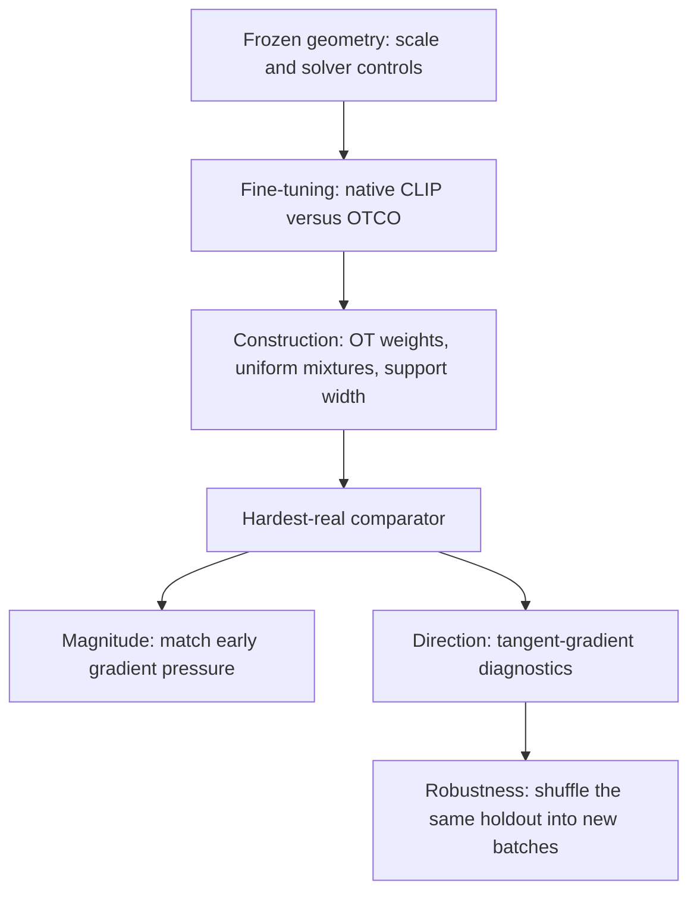
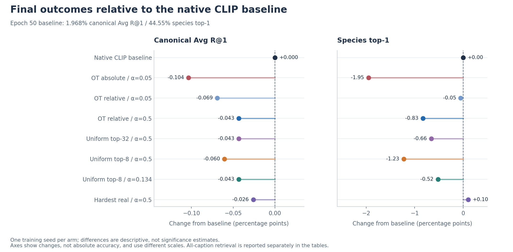
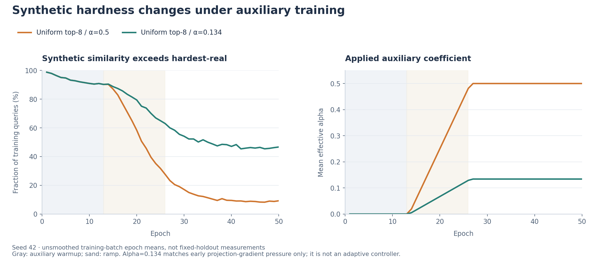
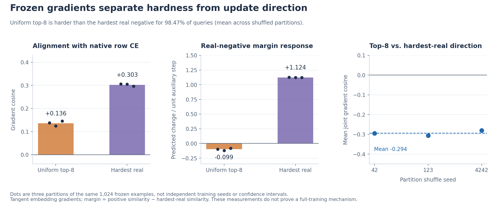

# CLIP experiments: construction, pressure, and gradient direction

[← Project overview](../README.md) · [Running commands](running-experiments.md) · [Source artifacts](../experiment_results/clip_2026-08-30_to_09-01/README.md)

This series, collected August 30–September 1, 2026, asks whether OTCO improves an already aligned pretrained CLIP model, and which parts of synthetic-negative construction actually matter. It progresses from frozen geometry checks to controlled fine-tuning, simpler construction controls, pressure matching, and frozen gradient diagnostics.



Arrows show the logic of the experimental questions, not a proven causal chain. [Training overview and downloadable figures](figures/README.md).

## Reading the evidence

The final canonical retrieval comparison shows no auxiliary-loss win over baseline in these single-seed runs. Frozen experiments show that synthetic negatives can be harder while their local gradient directions are less favorable for a real-negative margin. These observations support a mechanism question; they do not establish the cause of the full training outcome or rule out useful synthetic negatives in other settings.

Training and diagnostics have different candidate pools and units. Do not compare a 1,024-example frozen holdout recall directly with full-test retrieval, or treat a higher cosine similarity as an improvement in retrieval.

## Controlled training protocol

| Item | Recorded setting |
|---|---|
| Model | `openai/clip-vit-base-patch32`, matching processor, normalized embeddings |
| Trainable parameters | Image/text projections, final image/text encoder blocks, and logit scale; 10,895,617 parameters |
| Data | CUB-200 with Reed captions via `alkzar90/CC6204-Hackaton-Cub-Dataset` |
| Training split | 5,994 images minus the fixed 1,024-image diagnostic holdout = 4,970; exclusion intersection = 0 |
| Evaluation split | 5,794 images, 57,940 captions |
| Training | Seed 42, batch size 64, 50 epochs / 3,850 steps, epoch-random training captions |
| Optimizer | AdamW; projection LR 1e-5, encoder LR 1e-6, logit-scale LR 1e-6; weight decay 0.01; clipping at 1.0 |
| LR schedule | Cosine, 100-step warmup |
| Hardware | A100 40 GB, bf16 |
| Auxiliary schedule | 1,000-step warmup, then 1,000-step linear alpha ramp |
| OT settings | Fresh live-batch raw-cosine costs every step, historical sparse solver, epsilon 0.049, 30 iterations |
| Gates | Entropy gate disabled; positive-to-OT-selected-real gap thresholds +0.10 / −0.07 retained |
| Evaluation frequency | Epoch 0 and every training epoch |

The gap is measured against the **OT-selected real candidate**, not directly against the active synthetic. In uniform and hardest-real arms, the OT plan still supports gating/observational metrics. These runs therefore isolate the active negative construction, not the compute saving of removing OT entirely.

The archived [resolved configs](../experiment_results/clip_2026-08-30_to_09-01/README.md#training-artifacts) are the authority for each completed run; the current [source configs](../configs/) and [CLIP objective](../model/clip_training.py) provide the implementation.

### Auxiliary objectives

The base loss is native symmetric CLIP cross-entropy. The historical absolute auxiliary penalizes the synthetic logit with a sigmoid-style negative loss. The relative-denominator arms instead add

```text
D_i = log(sum_j exp(s_ij) + exp(s_i,extra)) - log(sum_j exp(s_ij))
    = softplus(s_i,extra - logsumexp_j(s_ij))

L_total = L_CLIP + alpha_effective * mean_i(D_i)
```

Ordinary and extra logits share a detached CLIP scale for this auxiliary branch; the native loss still trains the scale. A common additive logit shift cancels from D. Alpha=0.5 corresponds algebraically to adding one extra image-negative term to the text→image half of the symmetric objective at full activation; it does not guarantee equal gradient magnitudes between constructions.

For barycenters, selection/weights are detached but selected image features remain live through mixing and normalization. The hardest-real arm adds another denominator contribution from the highest-scoring non-positive image already in the batch. It is a duplicate real-negative contribution, not a new sampled image.

## Training experiments and their purpose

| Experiment | What changes | Question |
|---|---|---|
| Native CLIP baseline | No auxiliary loss | How much does ordinary caption fine-tuning improve retrieval and change species recognition? |
| OT absolute, alpha=0.05 | Add historical sigmoid-style synthetic loss, top-32 OT support | Does the original auxiliary transfer to pretrained CLIP? |
| OT relative, alpha=0.05 | Replace the absolute loss with D above | Does conditioning the penalty on CLIP's existing denominator improve compatibility? |
| OT relative, alpha=0.5 | Increase alpha tenfold | Is the relative auxiliary simply too weak at alpha=0.05? |
| Uniform top-32, alpha=0.5 | Uniform instead of OT weights on the same support | Does OT weighting help beyond local barycentric mixing? |
| Uniform top-8, alpha=0.5 | Narrow support from 32 to 8 | Does the stronger frozen hardness of narrower mixtures translate into better training? |
| Hardest real, alpha=0.5 | Use one real negative in the same relative objective | Does synthesis improve on a direct hard-negative contribution? |
| Uniform top-8, alpha=0.134 | Lower alpha to match hardest-real's early projection-gradient pressure | Can the difference be explained by auxiliary magnitude alone? |

### Final epoch-50 results

All numbers in the following tables are **percentages**. Canonical retrieval uses the first caption for each image and the full 5,794-image/caption candidate pools. Avg R@1 is the arithmetic mean of the two directions. Species top-1 uses `a photo of a {species_name}` prompts, not caption retrieval.

| Experiment / source summary | Canonical T→I R@1 | Canonical I→T R@1 | Canonical Avg R@1 | Species top-1 |
|---|---:|---:|---:|---:|
| [Native CLIP baseline](../experiment_results/clip_2026-08-30_to_09-01/training/baseline/summary.json) | 1.795 | 2.140 | 1.968 | 44.55 |
| [OT + absolute sigmoid, α=0.05](../experiment_results/clip_2026-08-30_to_09-01/training/ot_absolute/summary.json) | 1.847 | 1.881 | 1.864 | 42.60 |
| [OT + relative denominator, α=0.05](../experiment_results/clip_2026-08-30_to_09-01/training/ot_relative_a005/summary.json) | 1.795 | 2.002 | 1.899 | 44.49 |
| [OT + relative denominator, α=0.5](../experiment_results/clip_2026-08-30_to_09-01/training/ot_relative_a05/summary.json) | 1.829 | 2.019 | 1.924 | 43.72 |
| [Uniform top-32, α=0.5](../experiment_results/clip_2026-08-30_to_09-01/training/uniform_top32/summary.json) | 1.916 | 1.933 | 1.924 | 43.89 |
| [Uniform top-8, α=0.5](../experiment_results/clip_2026-08-30_to_09-01/training/uniform_top8/summary.json) | 1.795 | 2.019 | 1.907 | 43.32 |
| [Uniform top-8, α=0.134](../experiment_results/clip_2026-08-30_to_09-01/training/uniform_top8_pressure_matched/summary.json) | 1.864 | 1.985 | 1.924 | 44.03 |
| [Hardest real, α=0.5](../experiment_results/clip_2026-08-30_to_09-01/training/hardest_real/summary.json) | 1.812 | 2.071 | 1.942 | 44.65 |

The baseline has the highest final canonical average. OT and uniform top-32 tie on the average despite different directional results, so this does not demonstrate a benefit from OT weights. Lowering top-8's coefficient partly recovers species accuracy (43.32% → 44.03%) and canonical retrieval (1.907% → 1.924%), but still does not beat baseline. Hardest-real is slightly above baseline on species recognition and below it on canonical retrieval; these small one-seed differences do not establish a reliable ranking.



Changes are in percentage points, with separate axis scales for retrieval and species accuracy. No uncertainty intervals are inferred from a single training seed. [SVG](figures/clip_final_comparison.svg).

### All-caption retrieval

Text→image uses all 57,940 caption queries; image→text counts any of the image's captions as a correct retrieval. This is a different protocol from canonical retrieval.

| Experiment | All-caption T→I R@1 | All-caption I→T R@1 | All-caption Avg R@1 |
|---|---:|---:|---:|
| Native CLIP baseline | 1.372 | 2.572 | 1.972 |
| OT + absolute sigmoid, α=0.05 | 1.270 | 2.347 | 1.809 |
| OT + relative denominator, α=0.05 | 1.329 | 2.572 | 1.950 |
| OT + relative denominator, α=0.5 | 1.317 | 2.692 | 2.005 |
| Uniform top-32, α=0.5 | 1.327 | 2.641 | 1.984 |
| Uniform top-8, α=0.5 | 1.305 | 2.520 | 1.912 |
| Uniform top-8, α=0.134 | 1.319 | 2.606 | 1.962 |
| Hardest real, α=0.5 | 1.379 | 2.623 | 2.001 |

OT at alpha=0.5 and hardest-real show small all-caption average gains over baseline. This is why the conclusion is **no consistent gain across metrics**, rather than “every metric gets worse.” Full R@5/R@10 measurements remain in each source summary.

### Checkpoint selection

All runs start at **51.61% species top-1**, and all summaries select epoch 0 as the best species checkpoint. `best_model.pt` therefore does not represent the best caption-retrieval checkpoint. The final table above consistently uses `summary.final`.

For completeness, the highest observed canonical averages across the 51 logged evaluations are below; they are descriptive validation peaks, not a separately validated checkpoint-selection procedure. All tied peak epochs are listed.

| Experiment | Peak canonical Avg R@1 (%) | Epoch(s) |
|---|---:|---|
| Native CLIP baseline | 1.985 | 47 |
| OT + absolute sigmoid, α=0.05 | 1.959 | 31 |
| OT + relative denominator, α=0.05 | 1.993 | 31, 34 |
| OT + relative denominator, α=0.5 | 2.019 | 38 |
| Uniform top-32, α=0.5 | 1.993 | 38, 40 |
| Uniform top-8, α=0.5 | 1.968 | 27, 36 |
| Uniform top-8, α=0.134 | 1.993 | 35, 38 |
| Hardest real, α=0.5 | 1.985 | 45 |

Some treatments have slightly higher peaks than baseline. Reporting only those peaks would conceal the final-epoch and species-recognition tradeoffs.

## Pressure and training dynamics

### The pressure match was local and measured

Five early active-step projection-gradient measurements, reported in epoch 14, give the following mean auxiliary/base gradient-norm ratios:

| Arm | Alpha maximum | Mean measured ratio |
|---|---:|---:|
| Uniform top-8 | 0.5 | 0.00150182 |
| Hardest real | 0.5 | 0.00040282 |
| Uniform top-8 pressure-matched | 0.134 | 0.00040219 |

Sources: the epoch-14 rows in the archived [top-8](../experiment_results/clip_2026-08-30_to_09-01/training/uniform_top8/metrics.jsonl), [hardest-real](../experiment_results/clip_2026-08-30_to_09-01/training/hardest_real/metrics.jsonl), and [matched](../experiment_results/clip_2026-08-30_to_09-01/training/uniform_top8_pressure_matched/metrics.jsonl) metrics.

The matched ratio is within about 0.16% of hardest-real's ratio at these sampled steps. This validates the intended **early projection-gradient** control. It does not match all trainable gradients or cumulative optimization pressure, and the measurements occur near the beginning of alpha ramping. At epoch 50 the weighted auxiliary loss values differ: 0.02132 for matched top-8 versus 0.09596 for hardest-real. Loss magnitudes themselves are not gradient norms.

### The recorded gap gate does not adapt

Across all seven auxiliary arms, logged gate states are only `inactive_scheduled_alpha` and `fully_active`. No easy-gap suppression or hard-gap downweighting is recorded. Entropy gating is disabled by configuration. The CLIP runs therefore exercise warmup and ramping, without demonstrating a benefit from adaptive gap gating.

### Hardness changes as training proceeds

Fraction of uniform top-8 constructions with similarity above the hardest real negative, averaged over that epoch's training batches (including observations before auxiliary activation):

| Epoch | Top-8 alpha=0.5 | Top-8 alpha=0.134 |
|---|---:|---:|
| 13: before auxiliary activation | 90.28% | 90.28% |
| 26: near end of ramp | 27.62% | 63.03% |
| 50 | 9.23% | 46.69% |

These changing training-batch measurements are not the fixed frozen diagnostic. They show why an initial hardness observation cannot describe the entire fine-tuning trajectory.



All points are raw epoch means from the two training runs; shaded boundaries convert steps to epochs approximately. [SVG](figures/clip_hardness_dynamics.svg).

## Frozen diagnostics

These experiments update no model parameters. They use the held-out 1,024 training examples; full-pool and batch-emulation conditions are identified separately below.

| Diagnostic / source report | Purpose | Result and interpretation |
|---|---|---|
| [V1 geometry](../experiment_results/clip_2026-08-30_to_09-01/diagnostics/geometry_v1.json) | Inspect pretrained CLIP using historical scaled-logit OT settings | Mean selected rank 16.98 inside a top-32 support; strict-hardest agreement 3.91%; returned full-pool mass 0.831. A high percentile over the full pool is partly imposed by top-k preprocessing, and the sparse plan is not an exact balanced coupling. |
| [V2 scale and solver controls](../experiment_results/clip_2026-08-30_to_09-01/diagnostics/geometry_v2.json) | Separate epsilon/scale effects from geometry; audit transport feasibility and batch gates | Raw cosine epsilon 0.049 and scaled-logit epsilon 4.9 agree on every selected index; maximum row-normalized plan difference 1.79e-7. A support-preserving full-pool solver rejects 107 candidate columns without edges, making uniform column marginals infeasible on that support. |
| [Barycentric weights](../experiment_results/clip_2026-08-30_to_09-01/diagnostics/barycentric_weights.json) | Compare OT and uniform weights on identical full-pool top-32 support | Uniform is harder than OT for 97.56% of queries; uniform exceeds the hardest real negative for 99.22%, versus 74.22% for OT. Hardness does not require OT weighting. |
| [Support breadth](../experiment_results/clip_2026-08-30_to_09-01/diagnostics/support_breadth.json) | Compare OT/uniform at k=2,4,8,16,32 in 200 B64 emulations | At k=8, uniform exceeds hardest-real for 98.22% of observations versus 77.89% for OT; at k=32 the figures are 84.70% versus 87.58%. Weighting effects depend on support width. |
| [Adaptive neighborhood](../experiment_results/clip_2026-08-30_to_09-01/diagnostics/adaptive_neighborhood.json) | Select k by the largest adjacent rank-boundary cosine gap; compare with fixed k=8 and an evaluation-only hardness oracle | Adaptive exceeds hardest-real slightly more often (98.88% vs. 98.22%), but has lower mean synthetic similarity than fixed k=8 by 0.003965. Oracle headroom over fixed k=8 is only 0.001990 mean similarity. Different hardness summaries favor different choices. |
| [Sequential tangent gradients](../experiment_results/clip_2026-08-30_to_09-01/diagnostics/gradient_sequential.json) | Compare top-8 and hardest-real auxiliary directions on 16 sequential B64 batches | Mean joint cosine −0.295; 79.98% negative cosines. Predicted unit-step margin change: −0.108 for top-8 vs. +1.119 for hardest-real. |
| [Randomized tangent gradients](../experiment_results/clip_2026-08-30_to_09-01/diagnostics/gradient_randomized.json) | Test whether the sequential finding depends on batch composition | Three shuffled partitions preserve negative joint cosine and weaker top-8 margin updates; all prespecified qualitative robustness criteria pass. These are partition repetitions, not independent training seeds. |

V2's 200 B64 emulations also show why historical entropy thresholds cannot be transferred blindly: the historical scaled-logit condition is fully active in every emulation, while the matched-scale/raw-cosine conditions are entropy-suppressed in every emulation under the old threshold. Those were diagnostic gate simulations, distinct from the later training runs with entropy gating disabled.

The breadth and adaptive reports contain 12,800 observations from batches that reuse holdout examples. Their descriptive bootstrap intervals are not independent population guarantees. The adaptive oracle uses synthetic hardness only for evaluation and is not the deployed selector.

### Randomized gradient results in detail

The same 1,024 examples and canonical captions are partitioned into 16 disjoint B64 batches per condition: sequential, then shuffle seeds 42, 123, and 4242. No examples are resampled within a partition, and labels do not drive partitioning or negative selection. The following are means across the three shuffled partitions:

| Measurement | Uniform top-8 | Hardest real |
|---|---:|---:|
| Fraction harder than hardest-real | 98.47% | Reference |
| Alignment with native row-wise CLIP CE gradient | 0.136 | 0.303 |
| Effective image-gradient support | 12.22 | 3.57 |
| Predicted real-negative margin change under a unit auxiliary descent step | −0.099 | +1.124 |

The mean joint cosine **between the two auxiliary gradients** is −0.294; about 79.98% of query comparisons have negative cosine. This is not negative mean alignment with the native loss: the native-alignment means above are both positive. Hardest-real has the larger measured margin improvement for every query in each partition.



Bars show means across shuffled partitions; dots show the individual partition means. These are repeated partitions of the same frozen examples, not independent training seeds or confidence intervals. [SVG](figures/clip_gradient_geometry.svg).

Gradients are taken through normalization from unit-norm pre-normalization embedding leaves, giving tangent-space directions. The margin is `s_positive - s_hardest_real`; its directional change is `-grad(margin) dot unit(auxiliary_gradient)`. Effective support uses per-image gradient-norm shares and can exceed eight because the relative objective also differentiates through the ordinary row denominator.

The diagnostic evaluates a local embedding update, not a full encoder/AdamW update. Its margin explicitly references hardest-real, so that comparator is directly targeted by the metric. Same-species stratification is observational and does not establish which mismatches are semantically valid negatives.

## What is established, and what remains open

- **Established in these artifacts:** synthetics can have higher cosine similarity; uniform weights can match or exceed OT hardness; auxiliary gradient directions differ; and no auxiliary arm improves final canonical Avg R@1 over baseline.
- **Not established:** a general OT advantage, a causal explanation of training degradation, an effective adaptive CLIP gate, or a statistically reliable ranking from these one-seed training results.
- **Next diagnostic:** repeat the existing tangent-gradient measurements on fixed held-out batches just before auxiliary activation, after the ramp, and late in training.
- **Next validation:** additional training seeds with a declared retrieval/species endpoint and a consistent checkpoint-selection protocol.

The original [OT proposal](https://github.com/akashm776/ot-paper) motivated collective semantic confusion as a source of useful negatives. These experiments separate construction hardness from useful optimization direction. Scheduling or curriculum extensions remain hypotheses, not completed experiments.

## Provenance

All tables were computed from the archived JSON summaries and epoch metrics, not inferred from filenames or checkpoint weights. [The artifact manifest](../experiment_results/clip_2026-08-30_to_09-01/manifest.json) records source archive/member names and imported file hashes. The duplicate baseline download is counted once; the empty top-8 results ZIP is excluded in favor of its completed archive. Checkpoints, duplicate stdout, and large per-query CSVs are not included in Git.
