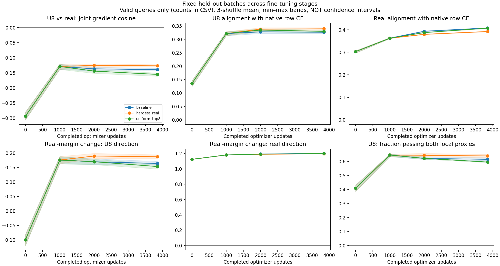

# Do synthetic-negative gradients become useful during fine-tuning?

[← Overview](../README.md) · [Previous CLIP evidence](clip-experiments.md)

**Status: completed on A100; single training seed.** This is a measurement experiment, not a new curriculum or a claim of improvement.

## Completed findings — September 11, 2026

All three 50-epoch arms and all 12 diagnostic snapshots completed. Baseline and both treatments have identical pretrained and pre-activation features. Ordinary native training changes mean U8 per-query real-margin direction from **−0.09934** at initialization to **+0.17583** at update 1,001, before any auxiliary pressure is applied. Mean native row-CE alignment rises from **0.13596 to 0.32152**. Thus the frozen mismatch does not describe every stage of fine-tuning.

That local improvement does not establish a training benefit: final canonical Avg R@1 is **1.967553% baseline**, **1.907145% uniform-top-8**, and **1.941664% hardest-real**. The U8-treated arm's mean margin direction is +0.17007 after the ramp and +0.15340 at the end, not a progressively stronger signal. All query-gradient measurements were valid in this run. An accidentally duplicated same-seed execution reproduced the features; it is **not a second independent seed**.



[Archived comparison CSV](../experiment_results/clip_curriculum_2026-09/staged_comparison.csv) · [Dense warmup follow-up](clip-warmup-readiness.md) · [Early-pulse intervention](clip-early-pulse.md). The original protocol and interpretation limits are retained below.

## Question and controls

The frozen diagnostic found that uniform top-8 negatives were harder than real negatives but often supplied conflicting embedding-gradient directions. Fine-tuning changes that geometry: does the mismatch persist when auxiliary pressure actually activates, or does a useful window emerge?

Repeat the existing diagnostic on three training trajectories, each restarted from pretrained CLIP with seed 42:

| Training arm | Why include it? |
|---|---|
| Native CLIP baseline | Detect geometry changes caused by ordinary fine-tuning alone |
| Uniform top-8, maximum α=0.5 | Measure the synthetic treatment at the moments it applies pressure |
| Hardest real, maximum α=0.5 | Control for auxiliary pressure without constructing a synthetic negative |

Optional: pressure-matched top-8, maximum α=0.134. This matches the **previous experiment's early** projection-gradient ratio, not pressure at every stage. Every arm's diagnostic compares both U8 and hardest-real candidates, regardless of which loss trains that arm. This directly tests the uniform-mixing ablation; it does not establish the behavior of OT-weighted barycenters.

Reuse the original 50-epoch, B64, bf16 training configs, optimizer, trainable subset, caption sampling, gates, and per-epoch test evaluation. No diagnostic score changes the schedule, optimizer, checkpoint selection, or stopping rule.

## Exact measurement times

The objective receives the number of updates already completed. With warmup=1,000 and ramp=1,000, α at objective step 1,000 is **still zero**, and first becomes positive at step 1,001.

| Stage | Completed updates | Position in the 77-batch/epoch run |
|---|---:|---|
| Pretrained reference | 0 | Before fine-tuning |
| Immediately before auxiliary activation | 1,001 | End of epoch 13; next update has positive scheduled α |
| After the ramp | 2,001 | Epoch 26, after its 76th update; just executed first full-strength scheduled-α update |
| Late | 3,850 | End of epoch 50 |

Baseline is measured at the same times but has no auxiliary pressure. Reports distinguish previous/next **scheduled** α; actual gate-adjusted effective α remains in the existing training logs. Unexpected total steps or schedules fail validation.

## What stays fixed

- The exact committed 1,024-image training-split diagnostic holdout, excluded from all optimizer batches.
- Canonical first captions and deterministic fp32 evaluation-mode encoding, matching the frozen diagnostic.
- B64 partitions: sequential, shuffle-42, shuffle-123, shuffle-4242. Each query appears once per partition at every stage. The three shuffled partitions reuse the same examples; they are **not independent experimental replicates**.
- The existing relative-denominator auxiliary losses and tangent-gradient calculation. Support selection is stop-gradient, while gradients through the selected image embeddings and normalized mixture remain live.

Top-8 support and hardest-real identity are **recomputed** from each model state. Fixing batches does not freeze the candidate identities. The current learned logit scale is used and recorded, detached for diagnostic differentiation.

The observer runs after optimizer/scheduler updates, encodes detached features, and uses fresh feature leaves for autograd. It never backpropagates into model parameters or consumes the training loader. Python, NumPy, PyTorch/CUDA RNG states and all module train/eval flags are restored, including on failure. Toy regression tests verify identical training updates with/without observation; this is not a guarantee of bitwise GPU reproducibility across environments.

## Reading the results

Primary measurements are U8/real joint-gradient cosine, alignment with native **text→image row CE**, and predicted change in the positive-minus-hardest-real raw-cosine margin under a unit auxiliary descent direction. The native reference is not the full symmetric training objective. A positive margin change means the direction locally improves that particular real-negative margin.

Also report the fraction passing **both** local proxies (positive native alignment and positive real-margin change), per-query stage transitions, gradient norms, support/species composition, and the original diagnostic summaries. “Passing both” is a descriptive screen, not a validated definition of downstream usefulness.

Undefined tiny-gradient directions are retained as flagged per-query records with their norms, never assigned a zero cosine. The staged observer uses the original metric thresholds (1e-12 for norm products or norms, as appropriate); the frozen diagnostic remains strict by default. Direction summaries exclude flagged rows and report their denominators. Always inspect coverage: apparent improvement caused by losing difficult/weak-gradient queries is not evidence for a useful stage. Paired transitions use queries valid at both stages.

The generated six-panel PNG/SVG plots show three-shuffle means and min–max bands, **not confidence intervals**. Sequential-partition results remain in the CSV and full reports. Lines connect only four measured states and do not localize an exact transition step.

A useful next signal would be a stage-dependent improvement in U8 alignment and real-margin change that is consistent across partitions, visible in paired queries, and not explained solely by baseline drift or changing valid-query coverage. Relate this to the saved retrieval/species trajectories, but do not infer that gradient changes caused performance changes. These are detached embedding gradients, not encoder gradients or AdamW updates; the margin reference itself favors the hardest-real comparator.

One training seed and a repeatedly inspected diagnostic holdout make this exploratory. An identified window should motivate a separately preregistered curriculum experiment with more seeds and untouched validation—not automatic tuning on these measurements.

## Run on Google Colab

Use the [Colab notebook](https://colab.research.google.com/github/akashm776/otco/blob/main/colabs/clip_gradient_stages.ipynb) on an **A100** runtime. It runs the pinned [Python runner](../colabs/run_clip_gradient_stages.py), following the existing Colab workflow. The default runs all three arms sequentially; edit `ARMS` to run one at a time, or add `pressure_matched`. Each arm is a full 50-epoch training job plus four diagnostics; allow a long GPU session. No GPU training has been launched from the development machine.

The runner checks the GPU, installs dependencies, tests the diagnostic/trainer, records the commit and package versions, then streams training logs. Every invocation uses a fresh timestamped output directory and refuses to overwrite arm results. Results ZIPs are downloaded after each arm; a final ZIP includes comparison plots. Checkpoints remain in `/content/otco_checkpoints/<run-id>/`; download them separately if wanted. Completed-stage features and reports are written immediately, and failures trigger a partial-results ZIP where possible. Colab runtime deletion still loses files not downloaded; this runner does not resume interrupted training.

The result bundle includes per-epoch training/evaluation metrics, resolved configs, holdout IDs/hashes, fixed partitions/hashes, per-stage metadata, compact CPU features with logit scale, per-query CSVs, detailed reports, paired transitions, stdout, and generated plots. Features allow the detached diagnostic to be revisited without repeating encoder inference; intermediate encoder checkpoints are not saved. No CUB image files are included.

Equivalent repository commands (CUDA required):

```bash
python -m src.clip_gradient_stages --arm uniform_top8 \
  --output-directory outputs/clip_gradient_stages_run1 \
  --checkpoint-directory checkpoints/clip_gradient_stages_run1
# Repeat with --arm baseline and --arm hardest_real, using the same root paths.
python -m src.clip_gradient_stages --plot-only \
  --output-directory outputs/clip_gradient_stages_run1
```

[Protocol config](../configs/clip_gradient_stages.yaml) · [Implementation](../src/clip_gradient_stages.py) · [Tests](../tests/test_clip_gradient_stages.py)
