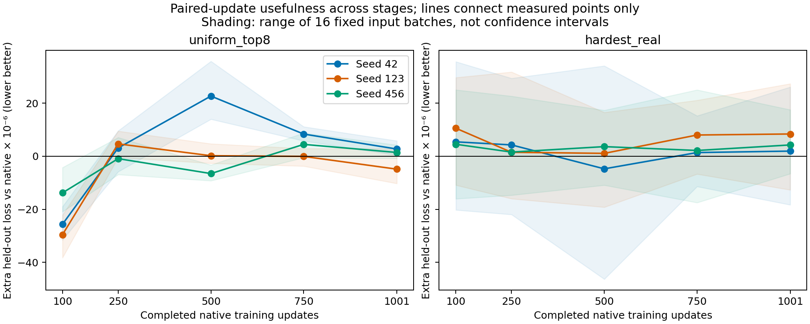

# Intermediate checkpoints: how does usefulness fade?

Status: **completed and audited**. All 720 records verified; the six seed/endpoint checks reproduce the previous recorded losses exactly. This extends the [completed three-seed comparison](clip-paired-seed-replication.md).

Mean synthetic-minus-native held-out loss ×10⁻⁶ (negative favors synthetic):

| Update | Seed 42 | Seed 123 | Seed 456 |
|---|---:|---:|---:|
| 100 | −25.63 | −29.56 | −13.80 |
| 250 | +3.12 | +4.66 | −0.90 |
| 500 | +22.68 | +0.20 | −6.53 |
| 750 | +8.36 | −0.05 | +4.47 |
| 1,001 | +2.72 | −4.87 | +1.43 |

Usefulness is not monotonic or governed by a shared cutoff. At update 500, synthetic helps seed 456 in 16/16 trials but hurts seed 42 in 16/16, in every partition. Near-zero cases remain partition-sensitive. Seed 123's later relative benefit reduces an absolute loss increase. These are small one-step effects, not demonstrated curriculum gains.

Source ZIP: `clip_paired_intermediate_20260912T131926_801067Z_complete.zip`, SHA256 `c34004cc190bf42bfe45e89fed137750b79ee0af7294ddcc306c1124f3eb4004`. [Raw numeric records, plots and audit are archived](../experiment_results/clip_paired_intermediate_2026-09/README.md). Checkpoints are not included, so GPU checks are verified recorded evidence, not independently rerun offline. [Predictor screening](clip-usefulness-predictors.md) · [Completed prospective seed test](clip-usefulness-prospective.md).

Intuitively, we have checked the same three journeys near the start and much later. Now we add three stops between them. At each stop, restore the model **and its optimizer memory**, try one ordinary update and one update with synthetic pressure on the same examples, then ask which transfers better to held-out examples. Each trial resets; the synthetic updates never alter the underlying training journey.

## Design fixed before running

| Component | Choice |
|---|---|
| Native training trajectories | Replay seeds **42, 123, 456**, through 1,001 updates |
| Checkpoints | **100, 250, 500, 750, 1,001** completed updates |
| New intermediate measurements | 3 seeds × 3 states × 16 batches × 3 arms = **432 branch records** |
| Endpoint reproducibility checks | 3 seeds × 2 states × 16 batches × 3 arms = **288 branch records** |
| Arms at each trial | Native-only, native + uniform-top-8 synthetic, native + hardest-real |
| Total | **720 branches**, 240 per seed |

These are the **same three seeds**, not three additional independent replicates. The earlier downloaded ZIPs contain reports, not intermediate model/AdamW checkpoints, so fresh baseline replays are necessary. Stop after 13 epochs while preserving the original 50-epoch / **3,850-update learning-rate horizon**.

Keep the [original paired protocol](../configs/clip_paired_updates.yaml): 16 fixed B64 training batches, diagnostic captions at seed 42/epoch 2, 1,024 excluded held-out examples, the same evaluation partitions and branch RNG seeds. Calibration identities remain excluded; coefficients stay **0.06005351588542947** for synthetic and **0.3753711620568176** for hardest-real. No recalibration, coefficient search or holdout-based tuning.

The update is actual AdamW with native gradient clipping and bf16 training, not a gradient-dot-product approximation. Held-out encoding uses fp32; the contrastive loss calculation uses fp64. Each branch starts with identical model, optimizer and scheduler states. Existing no-update re-encoding, native-update replay, optimizer-reset, frozen-parameter and source-integrity checks remain enabled.

## Reproducibility gates

At updates **100 and 1,001**, require exact agreement with each seed's archived normalized model/optimizer/scheduler state hash, held-out feature hash and learning rates. Compare every endpoint branch's held-out and training losses with the historical records using an absolute tolerance of **1e-8**, with no relative tolerance. A mismatch stops the experiment and records available diagnostics; the script does not loosen the checks automatically.

Intermediate observations preserve global RNG states and model modes. Their saved checkpoints must reproduce their own recorded feature hashes before probing. Torch and torchvision must match the archived versions exactly; the launcher also pins the earlier datasets, transformers, NumPy and PyYAML versions. Passing local tests verifies implementation plumbing, not GPU endpoint reproducibility—that is a runtime gate.

## What we will read from the results

The primary quantity is **held-out loss after auxiliary update minus held-out loss after native-only update**, averaged over the same three shuffled partitions. Negative means the auxiliary helped *relative to the ordinary step*, not necessarily relative to the initial checkpoint. Report the absolute initial-to-updated change alongside it, especially because seed 123's previous later benefit reduced an increase in loss.

The combined PNG/SVG plots show each seed's mean at all five checkpoints, separately for synthetic and real controls. Shading shows the range across the 16 fixed diagnostic batches, **not a confidence interval**; lines connect measured points, not an inferred continuous trajectory. Raw branch records also retain individual partition losses, training losses, gradient alignments and update differences for follow-up analysis.

Look for whether benefit weakens gradually, varies non-monotonically, or changes sign at different stages for different seeds. Check agreement across individual evaluation partitions rather than relying only on the primary average. Do **not** choose an automatic switch-off step, fit a universal decay law, or interpret these reused batches as independent training replicates. Five states can locate broad transitions but cannot identify an exact crossing time.

This is still CLIP/CUB-200, three seeds and a reused holdout. Learning rates, optimizer moments and relative auxiliary pressure change together, so the experiment describes stage dependence without isolating its cause. Any curriculum selected after inspection needs a separate training intervention and independent evaluation.

## One Colab cell — no Drive

Paste the entire [one-cell launcher](../colabs/clip_paired_intermediate_one_cell.py) into an **A100** Colab code cell. Run only that cell, not older Drive-based cells. It executes the three seeds sequentially, prints progress and downloads one combined results ZIP when all five states pass for all three seeds.

Everything stays on local `/content/`: caches, checkpoints, reports and logs. **No Google Drive mounting or writes.** The runner requires at least **25 GiB** of free local disk. The download includes reports, manifests, training metrics, diagnostic identities and graphs, but excludes large model checkpoints and dataset tensors. Checkpoints remain on the runtime disk only.

The final marker must say `complete` with **720 total / 432 intermediate / 288 endpoint** branch records. Rerunning the cell after successful completion re-downloads its matching local ZIP without retraining. A handled training failure produces an `interrupted_or_failed.zip`; a new attempt starts fresh rather than resuming partial training. Preflight failures stop before training.

Keep browser downloads allowed and the Colab tab open. The runner prints `LOCAL_ARCHIVE` and SHA256 for manual retrieval if necessary. Local-only storage does not protect against VM deletion, and active computation does not guarantee runtime survival; see the [Colab FAQ](https://research.google.com/colaboratory/faq.html). There is no external backup under the requested no-Drive policy.

[Study config](../configs/clip_paired_intermediate.yaml) · [Checkpoint orchestration and plots](../src/clip_paired_intermediate.py) · [Foreground runner](../colabs/run_clip_paired_intermediate.py) · [Tests](../tests/test_clip_paired_intermediate.py)
