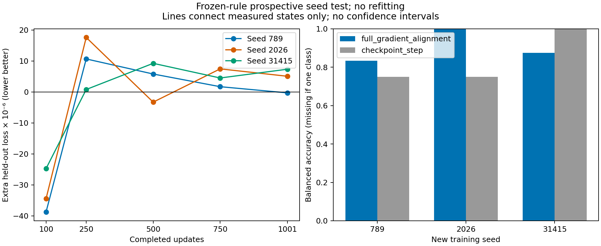

# Prospective new-seed test of frozen usefulness rules

Status: **completed and audited**, all 720 branches. Question: does an alignment-based rule transfer to new CLIP/CUB training trajectories better than a training-step rule?

## Findings

| Frozen rule | Mean seed balanced accuracy | Correct states | Correct outside ±1e-6 |
|---|---:|---:|---:|
| Full-gradient alignment | **90.28%** | 13/15 | 12/13 |
| Training step | 83.33% | 13/15 | 12/13 |

The prespecified primary difference is **+6.94 percentage points** for alignment. Per-seed differences are +8.33 (789), +25.00 (2026), and −12.50 (31415). Balanced accuracy weights detection of helpful and harmful states equally within each seed before averaging seeds; it is not ordinary pooled accuracy.

Alignment detects all five helpful states, including a near-zero late effect, but makes two false-positive predictions. Step detects three helpful states and makes no false positives. Both rules classify 13/15 states correctly and tie at 12/13 after the fixed near-zero exclusion. Thus this is modest positive evidence on the primary metric, not decisive superiority.

The clearest transferred signal is seed 2026 at update 500: synthetic mean extra held-out loss is **−3.28 ×10⁻⁶**, beneficial in 12/16 trials, with beneficial means in every partition. Alignment predicts this return of usefulness; the timing rule misses it. It also incorrectly predicts benefit at seed 789/update 750 (+1.71 ×10⁻⁶) and seed 31415/update 250 (+0.80 ×10⁻⁶, near zero). Some weak effects are partition-sensitive.

[Raw records, frozen rules, predictions and audit](../experiment_results/clip_usefulness_prospective_2026-09/README.md). No rule was refitted. These are three new training seeds, not fifteen independent models or a fresh evaluation dataset. No gate-driven training was tested. Keep the rules frozen and test a separate evaluation set before making a curriculum claim; no further run has been started.

## Decisions frozen before the new runs

The [development screening](clip-usefulness-predictors.md) used seeds 42, 123 and 456. Alignment classified 11/15 held-out states correctly versus 9/15 for step; excluding effects within ±1e-6, both scored 9/12. This is motivation to test, not confirmation of a gate.

Fit the existing deterministic single-feature threshold procedure once on **all fifteen development states**, then freeze:

| Rule | Predict synthetic benefit when |
|---|---|
| Full-gradient alignment — primary | Mean cosine > **0.030847286945687016** |
| Training step — comparator | Completed updates ≤ **175** |

The [frozen artifact](../configs/clip_usefulness_frozen_rules.json) preserves the development state table, source archive/script hashes and fitted rules. The exact numerical boundary is a fitted development value, not a claim of physical precision. The step rule predicts benefit only at update 100 on the measured grid; update 175 is not a measured checkpoint. No projection-head alternative, threshold adjustment or feature search on the new outcomes.

## New experiment

- New training seeds: **789, 2026, 31415**; no overlap with development seeds.
- States: **100, 250, 500, 750, 1,001** completed updates.
- Native baseline training: 13 epochs / 1,001 updates, retaining the original **3,850-update LR horizon**.
- Same 16 B64 diagnostic batches/captions, original calibration exclusions, auxiliary coefficients and 1,024-example held-out partitions.
- Three reset branches per trial: native-only, uniform-top-8 synthetic, hardest-real. **720 new branch records**, summarized as **15 seed/checkpoint states**, not 720 independent training replicates.
- New seeds have no historical endpoints. Instead, every saved checkpoint must exactly reproduce its own observed held-out feature hash, with the existing optimizer-reset, no-update/native-update replay and frozen-state checks.

Rules are recorded before training, predictions use only their named feature, and **nothing is refitted on new outcomes**. The experiment does not use predicted labels to modify the native trajectories. It tests a diagnostic rule, not a gate-controlled curriculum rollout.

## Prespecified readout

Primary: for each seed, balanced accuracy of the alignment rule minus balanced accuracy of the step rule; average these three differences. Positive favors alignment descriptively. Report all per-seed results and ordinary correct counts. A seed containing only one outcome class has undefined balanced accuracy; report null, and do not silently replace it or drop that seed from the primary average.

Labels use the sign of mean synthetic-minus-native held-out loss across the original shuffled partitions. Secondary: correct counts excluding **|effect| ≤ 1e-6**, without refitting. Preserve absolute initial-to-updated losses so relative benefit is not confused with absolute improvement. PNG/SVG figures show usefulness curves and per-seed classification scores. Hardest-real remains an archived control, not an additional predictor-selection opportunity.

No significance test, confidence interval or automatic success-to-curriculum decision follows from three new seeds. This is prospective with respect to **training seeds**, not an independent evaluation dataset: CLIP/CUB and diagnostic inputs/holdout are reused. Alignment is measured on fixed training probes, not a validated online signal. Any later gate-driven training intervention requires a separate experiment.

## Run — one cell, no Drive

Use the entire [one-cell launcher](../colabs/clip_usefulness_prospective_one_cell.py) in an **A100** Colab runtime. Run only this new cell, not “Run all”. It downloads immutable source, tests it, runs all three seeds sequentially and requests one combined ZIP download with the frozen artifact, raw records, predictions, scores, logs and graphs.

No Google Drive mounts or writes. Allow **25 GiB** free local runtime disk. Checkpoints/caches remain in `/content`; large `.pt` files are omitted from the downloaded ZIP. A handled training failure produces a failed ZIP; a deleted VM loses local files and cannot be recovered from Drive. An active cell does not guarantee VM survival. A successful cell rerun re-downloads its matching local archive without retraining.

The previous comparable three-seed/five-state run took about 74 minutes; this is a rough local reference, not a runtime guarantee. Final completion must record all **720 branches / 15 states / rules_refitted=false** and pass an independent recomputation of prediction scores.

[Study config](../configs/clip_usefulness_prospective.yaml) · [Orchestration/scoring](../src/clip_usefulness_prospective.py) · [Runner](../colabs/run_clip_usefulness_prospective.py) · [Tests](../tests/test_clip_usefulness_prospective.py)
