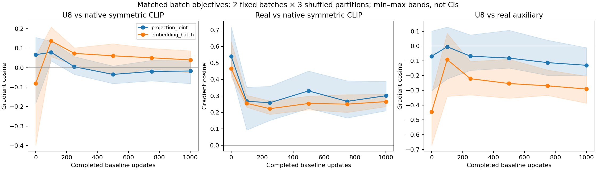

# Warmup readiness: when does the synthetic direction change?

[Previous staged experiment](clip-gradient-stages.md) · [Project overview](../README.md)

## Completed findings — September 11, 2026

All six snapshots completed. The baseline endpoint feature hashes exactly reproduce the earlier 50-epoch run's corresponding states; the observer did not change that realized trajectory. The local audit verified 24,576 valid query-partition observations and 192 projection/batch records.

| Completed updates | Mean per-query U8 margin change | U8 vs native: shared-head gradient cosine | Positive shared-head batches |
|---:|---:|---:|---:|
| 0 | −0.0993 | +0.0663 | 5/6 |
| 100 | +0.1383 | +0.0784 | 6/6 |
| 250 | +0.1670 | +0.0043 | 2/6 |
| 500 | +0.1769 | −0.0348 | 1/6 |
| 750 | +0.1831 | −0.0196 | 2/6 |
| 1,001 | +0.1758 | −0.0174 | 2/6 |

Means use the three shuffled partitions; head measurements use two selected batches per partition. These are reused inputs, not independent seeds. The original per-query reference is native row CE, whereas the head reference above is native symmetric CLIP. Matched batch-level embedding controls show that aggregation matters as well as the mapping into shared weights. Real-negative head alignment remains positive (approximately 0.25–0.54).



**Interpretation:** ordinary fine-tuning makes the average per-query margin proxy positive by update 100, but that does not imply a broadly useful shared-parameter instruction. The weak early head-alignment signal motivated the [completed early-pulse pilot](clip-early-pulse.md), which did not show convincing overall benefit. This is not evidence that step 100 is universally optimal.

[Archived numeric analysis](../experiment_results/clip_curriculum_2026-09/warmup_analysis.json). The original pre-result protocol follows.

## Preregistered experiment

Baseline-only CLIP fine-tuning, seed 42, stopped after **1,001 updates / 13 epochs**. Keep the original 50-epoch learning-rate schedule (3,850-update horizon); shortening the schedule itself would change the trajectory. No synthetic loss is applied during training. Measure at **0, 100, 250, 500, 750, 1,001** completed updates.

The existing 1,024-example excluded holdout, canonical captions, and all four B64 partitions remain fixed. Repeat the previous per-query tangent diagnostic in fp32/eval mode, with the same candidates, losses, learned detached logit scale, undefined-gradient handling, and RNG preservation.

## Added parameter-space check

Before seeing results, select the **first two batches of each existing partition**: eight fixed batches total. The three shuffled partitions contribute six batches to the primary summary; sequential results are retained separately. Reused queries/batches are not independent seeds.

Capture the current encoder outputs immediately before the CLIP projection heads while encoding the same diagnostic holdout. Reapply the live projection heads to detached encoder outputs and verify reconstruction of the diagnostic embeddings. This computes the exact gradients with respect to the projection-head weights conditional on that model state; it does not approximate those derivatives by detached embedding gradients. Save the pooled inputs and projection weights for reproduction.

On every selected batch compare gradients of:

- Mean uniform-top-8 relative-denominator auxiliary loss.
- Mean hardest-real relative-denominator auxiliary loss.
- Native **symmetric CLIP loss** (primary reference).
- Native text→image row CE (bridge to the old diagnostic).
- Mean positive-minus-hardest-real raw-cosine margin.

Report gradient cosines, norms, U8/real norm ratio, and margin directional changes jointly across heads and separately for each head. Auxiliary gradients are unweighted counterfactual measurements; alpha is zero throughout training. Selection is stop-gradient, but candidate embedding paths remain live. Autograd reads head derivatives without modifying parameter `.grad` or optimizer state.

Compute a **matched batch-level tangent-embedding probe** using the same batch objectives. Comparing this with projection gradients separates representation-space effects from the per-query-vs-batch aggregation difference in the old diagnostic. Unit-direction margin magnitudes depend on the coordinate system and must not be compared numerically across spaces.

This is still not a full encoder-gradient or AdamW-update diagnostic. Batch-level head agreement does not prove per-query utility, out-of-batch generalization, or an improvement from adding an auxiliary term.

## Interpretation and outputs

Look for when the average synthetic real-margin effect changes sign, whether the change is consistent across partitions, and whether native-objective alignment improves on the projection heads as well as in embedding space. Disagreement between symmetric-loss and row-loss alignment matters; do not substitute one for the other.

Six snapshots can bracket a transition, not identify a unique optimal activation step. This is exploratory single-seed evidence, not permission to select a curriculum based on test-set performance. Reproduction of the previous step-0 and step-1,001 feature hashes is a useful non-interference check.

Outputs include six complete embedding diagnostics, **192 projection-space/batch records** (6 stages × 4 partitions × 2 batches × 4 spaces), recorded selected batch indices, pooled encoder inputs/head weights, 13-epoch training/evaluation logs, standard checkpoints, and embedding/projection plots. `completion.json` distinguishes successful completion of this short experiment from a full 50-epoch run.

```bash
python -m src.clip_warmup_readiness \
  --output-directory outputs/clip_warmup_readiness_run1 \
  --checkpoint-directory checkpoints/clip_warmup_readiness_run1
```

[Protocol](../configs/clip_warmup_readiness.yaml) · [Implementation](../src/clip_warmup_readiness.py) · [Tests](../tests/test_clip_warmup_readiness.py)
